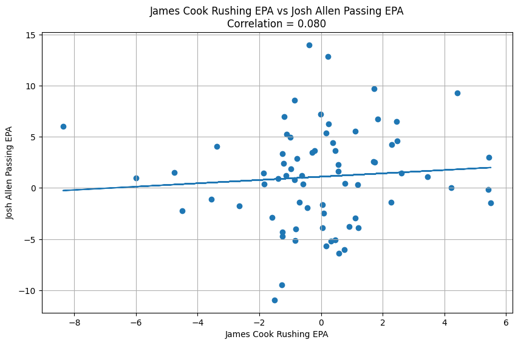
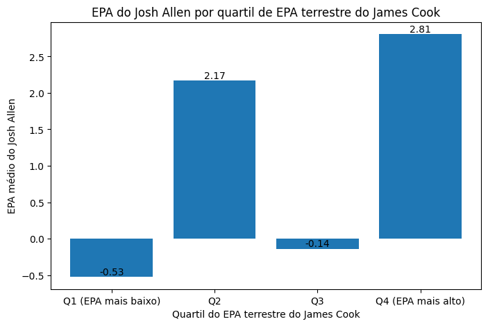
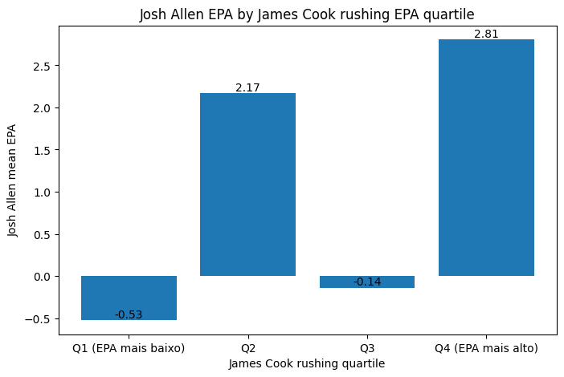

# Does A Running Back's Rushing Efficiency Impact A Quarterback's Passing Performance? - Available in PT-BR / EN

## 🇧🇷 Português

## Visão Geral

Este projeto investiga como a eficiência terrestre de um Running Back afeta a performance aérea de um Quarterback.

Usando dados play-by-play da temporada de 2025 da NFL, a análise compara como diferentes métricas (jardas e Expected Points per Attempt, ou simplesmente EPA) afetam o desempenho de um quarterback. Foram escolhidos como exemplo o running back James Cook e o quarterback Josh Allen, ambos do Buffalo Bills.

## Ferramentas usadas

- Python
- Numpy
- Pandas
- Matplotlib
- SciPy

## Metolodogia

A análise foi feita em três estágios diferentes:

1. Agregação do EPA por quarto de Josh Allen.
2. Agregação do EPA por quarto de James Cook.
3. Comparação da performance usando:
   - Análise de correlação
   - Análise de quartil
   - Teste T de Welch
  

## Análise de correlação

Há uma fraca correlação entre o EPA de Josh Allen e o EPA de James Cook (r = 0.08).

Esse dado sugere que a relação entre as variáveis não é linear.

## Análise de quartis

## Informações significativas

Quando comparando o maior e menor quartil do EPA de James Cook:

| Quartil | Josh Allen EPA Médio |
|-----------|-----------|
| Q1 (EPA mais baixo) | -0.53 |
| Q4 (EPA mais alto) | 2.81 |

Diferença: +3.33 EPA

## Teste estatístico

Um Teste T de Welch foi foi usado para comparar o EPA de Josh Allen entre os melhores e piores quartis terrestres de James Cook.

O resultado foi um p = 0.0265.

## Conclusão

Não foram encontradas evidências que mostrem que o EPA terrestre alto de James Cook afeta linearmente o EPA aéreo de Josh Allen. Apesar disso, os melhores quartos de James Cook foram associados ao melhores quartos de Josh Allen.

A diferença entre o maior e o menor quartil de EPA foi notável (p < 0.05), o que sugere que boa performance no jogo terrestre pode influenciar positivamente o jogo aéreo em cenários extremos.

---
## 🇺🇸 English

## Overview

This project investigates how a Running Back's rushing efficiency affects a Quarterback's passing performance.

Using NFL 2025 season play-by-play data, the analysis compares how different metrics (rushing yards and Expected Points Added, or EPA) impact quarterback performance. Buffalo Bills running back James Cook and quarterback Josh Allen were selected as the subjects of this study.

## Tools Used

- Python
- NumPy
- Pandas
- Matplotlib
- SciPy

## Methodology

The analysis was conducted in three different stages:

1. Aggregation of Josh Allen's passing EPA by quarter.
2. Aggregation of James Cook's rushing EPA by quarter.
3. Performance comparison using:
   - Correlation analysis
   - Quartile analysis
   - Welch's t-test

## Correlation Analysis

A weak correlation was found between Josh Allen's passing EPA and James Cook's rushing EPA (r = 0.08).

This result suggests that the relationship between the variables is not linear.

## Quartile Analysis

## Key Findings

When comparing the highest and lowest quartiles of James Cook's rushing EPA:

| Quartile | Josh Allen Mean EPA |
|-----------|-----------|
| Q1 (Lowest EPA) | -0.53 |
| Q4 (Highest EPA) | 2.81 |

Difference: +3.33 EPA

## Statistical Test

A Welch's t-test was used to compare Josh Allen's EPA between the highest and lowest rushing EPA quartiles of James Cook.

The result was p = 0.0265.

## Conclusion

No evidence was found to suggest that James Cook's rushing EPA linearly affects Josh Allen's passing EPA. However, James Cook's best quarters were associated with Josh Allen's best quarters.

The difference between the highest and lowest EPA quartiles was statistically significant (p < 0.05), suggesting that strong rushing performance may positively influence passing performance in extreme scenarios.
